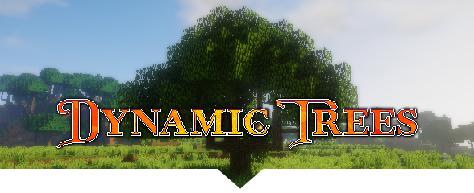

# Dynamic Trees 

Minecraft Forge mod providing dynamic trees that progressively grow from seed to maturity.

This branch is for the 1.18.2 version of Minecraft.

### Links
- [CurseForge](https://minecraft.curseforge.com/projects/dynamictrees)
- [Modrinth](https://modrinth.com/mod/dynamictrees)
- [Discord](https://discord.gg/A4FCBS3)

### Compiling
* Clone the repository.
* Open a command prompt/terminal to the repository directory.
* Run `gradlew build` on Windows, or `./gradlew build` for MacOS or Linux.
* The built jar file will be in `build/libs/`.
